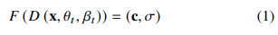
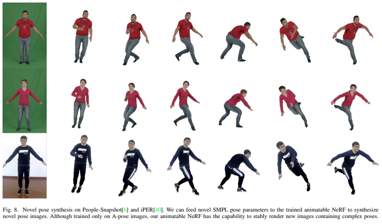

# awesome-pose
* curated list for pose estimation
* 3DPW models : https://paperswithcode.com/sota/3d-human-pose-estimation-on-3dpw

## Multi-View - Human Pose Estimation, Human Mesh Recovery
* <b>2019/09</b> Cross View Fusion for 3D Human Pose Estimation [[paper]](https://arxiv.org/pdf/1909.01203.pdf) [[code]](https://github.com/microsoft/multiview-human-pose-estimation-pytorch)
> - Multi-View 이미지들을 CNN으로 각각 heatmap 추출한 뒤 fusion하여 각 view의 히트맵이 다른 뷰의 이점을 얻도록 함.
> - Multi-View 2D pose에서 3D 포즈를 복구하도록 처리
> - 여러 단계 프로세스를 통해 관절 위치를 재귀적으로 미세 조정
> - 각 관절을 개별적으로 refine(수정)하는 게 아니라 공간적 관계를 고려하여 모든 관절을 동시에 refine함
* <b>2021/11</b> Direct Multi-view Multi-person 3D Human Pose Estimation [[paper]](https://arxiv.org/pdf/2111.04076.pdf) [[code]](https://github.com/sail-sg/mvp)
* <b>2022/01</b> AirPose: Multi-View Fusion Network for Aerial 3D Human Pose and Shape Estimation [[paper]](https://arxiv.org/pdf/2201.08093.pdf) [[code]](https://github.com/robot-perception-group/AirPose)
> - 외부적으로 보정되지 않은 여러 대의 비행 카메라로 캡처한 이미지를 사용하여 사람의 자세와 모양을 추정하는 방법(AirPose), SMPL-X 사용, 더 좋은 mocap 품질이 필요한 오프라인 애플리케이션을 위한 최적화 기반의 후처리 방법(AirPose+) 제안
* <b>WACV 2021</b> 3D Human Pose and Shape Estimation Through Collaborative Learning and Multi-view Model-fitting [[paper]](https://openaccess.thecvf.com/content/WACV2021/papers/Li_3D_Human_Pose_and_Shape_Estimation_Through_Collaborative_Learning_and_WACV_2021_paper.pdf) [[code]](https://github.com/leezhongguo/MVSPIN_NEW)
> - Multi-View 기반의 회귀 학습 루프를 이용해서 3D human pose, shape estimation. 
> - 먼저 CNN으로 multi-view 이미지에서 각각 SMPL shape, pose를 회귀한 뒤, 그 값들을 초기값으로 활용하여 multi-view 이미지에 동시에 최적화되도록 하는 방법.
* <b>2021/10</b> Dynamic Multi-Person Mesh Recovery From Uncalibrated Multi-View Cameras [[paper]](https://arxiv.org/pdf/2110.10355.pdf) [[code]](https://github.com/boycehbz/DMMR)
> - 보정되지 않은 Multi-View 카메라(카메라 매개변수가 알려지지 않은 상태)를 이용한 Dynamic(움직이는 동작) 여러 사람들의 Mesh 복원 방법(물리적 일관성을 이용해서 해결). 
> - Encoder-Decoder 네트워크를 사용하고, Encoder와 Decoder 내부에는 GRU 사용함.
* <b>2021/06</b> Part-aware Measurement for Robust Multi-View Multi-Human 3D Pose Estimation and Tracking [[paper]](https://arxiv.org/pdf/2106.11589.pdf) [[code]](https://github.com/B10532021/Part-Aware_Measurement_for_3D_Pose_Estimation_and_Tracking)
> - Multi-View 기반의 카메라 상황에서 Object Detection(YOLOv3)을 통해 사람만 추출한 뒤, 2D Pose Estimation(HRNet) 처리, 그 후 시간적 일관성(temporal correspondences)을 이용해서 모든 뷰에서 동일한 3D pose로 나오도록 최적화 작업 진행
> - 구체적으로 2D-3D 연관을 위한 Part-Aware(부분 인식) 측정과 재구성 과정에서 2D Outlier(이상치)에 대처할 수 있는 필터를 제안함. (목적은 3D Human Pose Estimation)
* <b>2021/04</b> Multi-View Multi-Person 3D Pose Estimation with Plane Sweep Stereo [[paper]](https://arxiv.org/pdf/2104.02273.pdf) [[code]](https://github.com/jiahaoLjh/PlaneSweepPose)
> - 동기화(synchronized)되고 보정된(calibrated) 상태의 multi-view 카메라 사용
> - 각 카메라 뷰에 대해 독립적으로 HRNet 모델을 이용한 2D Pose 추정 진행, 그 후 multi reference view에서 2D pose 감지를 활용하여 target camera view 아래에 있는 Joints 2D 후보에 대해 depth 회귀(regression)를 수행함
* <b>2021/09</b> Neural Human Performer: Learning Generalizable Radiance Fields for Human Performance Rendering [[paper]](https://arxiv.org/pdf/2109.07448.pdf) [[code]](https://github.com/YoungJoongUNC/Neural_Human_Performer)
> - Temporal Transformer, Multi-View Transformer, NeRF (Clothed Body Mesh)

## Human Mesh Recovery
* <b>2020/08</b> frankmocap(3d body+hand motion capture) : Fast Monocular 3D Hand and Body Motion Capture by Regression and Integration [[paper]](https://arxiv.org/abs/2008.08324)[[code]](https://github.com/facebookresearch/frankmocap)[[skeleton info]](https://github.com/facebookresearch/frankmocap/blob/master/docs/joint_order.md)
* <b>2020/08</b> I2L-MeshNet : Image-to-Lixel Prediction Network for Accurate 3D Human Pose and Mesh Estimation from a Single RGB Image [[paper]](https://arxiv.org/abs/2008.03713)[[code]](https://github.com/mks0601/I2L-MeshNet_RELEASE)
* <b>2020/08</b> ROMP: Monocular, One-stage, Regression of Multiple 3D People [[paper]](https://arxiv.org/abs/2008.12272) [[code]](https://github.com/Arthur151/ROMP) : 실데이터 확인 시 준수한 성능을 보입니다.
* <b>2021/04</b> MeshGraphormer [[paper]](https://arxiv.org/abs/2104.00272) [[code]](https://github.com/microsoft/meshgraphormer) : Microsoft의 이전 논문인 METRO 논문에 GCNN을 추가하여 성능을 향상시킨 논문입니다. 실데이터로 확인 시 폐색에 취약한 결과를 나타냈습니다.
* <b>2021/04</b> PARE: Part Attention Regressor for 3D Human Body Estimation [[paper]](https://arxiv.org/abs/2104.08527) [[code]](https://github.com/mkocabas/PARE) : 실데이터 확인 시 준수한 성능을 보입니다.
* <b>2021/10</b> Learning to Regress Bodies from Images using Differentiable Semantic Rendering
 [[code]](https://github.com/saidwivedi/DSR) [[paper]](https://arxiv.org/abs/2110.03480)
* <b>2021/11</b> Out-of-Domain Human Mesh Reconstruction via Dynamic Bilevel Online Adaptation 
[[paper]](https://arxiv.org/abs/2111.04017) [[code]](https://github.com/syguan96/dynaboa) [[project]](https://sites.google.com/view/dynaboa)
> - 2021/12 기준 3DPW SOTA, unsupervised online adaption 기반의 모델이라는 점에서 개념적으로 좋지만, 해당 도메인에 대한 skeleton 데이터가 항상 필요하고, 해당 데이터로 학습 진행 후 추론하는 느낌입니다.
> - 실데이터로 확인 시 결과가 좋지 않고, 시간이 너무 오래걸립니다.
* <b>2020/10</b> Invariant Representation Learning for Infant Pose Estimation with Small Data
 [[paper]](https://arxiv.org/abs/2010.06100) [[code]](https://github.com/ostadabbas/Infant-Pose-Estimation)
* <b>2021/06</b> Animatable Neural Radiance Fields from Monocular RGB Videos [[paper]](https://arxiv.org/pdf/2106.13629.pdf) [[code]](https://github.com/JanaldoChen/Anim-NeRF)
> - NeRF 및 SMPL parameter 공동 최적화
> - Animatable neural radiance fields (animatable NeRF), F : 3D position(x,y,z), shape 𝛽, pose 𝜃를 color c =(r,g,b) 와 density σ로 매핑함
> - 
> - 위의 식에서 D(x, 𝜃, 𝛽)는 다른 프레임들간의 사람 움직임들을 다루기 위해, 관찰 영역 내의 3D position x = (x,y,z)를 표준 영역(canonical space)의 x_0 = (x0, y0, z0)로 변형한다. NeRF의 시점(view) 의존성은 철이나 유리에 비춘 것과 같은 거울 반사를 주로 다룬다. 하지만 사람의 피부와 옷들은 분산되어 있기 때문에(매우 다양해서 그런 것 같습니다), 이 논문에서는 시점 방향(viewing direction)을 제거한다. 
> - A Pose Sequence(한바퀴 도는 영상, A포즈로)로 학습해서 그 사람의 옷, shape 다 따서 다른 자세로 변형 가능하도록 함
> - 
> - 한계점 : 최상의 결과를 얻으려면 수행자가 천천히 몸을 돌리고 간단한 포즈(A-Pose)를 취하면서 옷이 고품질 렌더링을 위해 몸에 거의 고정되도록 해야한다. 
> - 한 장면에 학습된 모든 NeRF기반 방법들과 마찬가지로 보이지 않는 부분은 재구성이 어려워서 input video에 최대한 뷰가 담겨있어야함.
* <b>2022</b> Accurate 3D Body Shape Regression using Metric and Semantic Attributes [[paper]](https://ps.is.mpg.de/uploads_file/attachment/attachment/691/00928.pdf) [[code]](https://github.com/muelea/shapy)
> - single image + 신체 속성 수치값(키, 몸무게, 가슴둘레, 허리둘레 등)을 모델 에이전시 데이터, 유명인 데이터를 활용해서 수집해서 학습에 이용함
> - 좀 더 shape이 잘 나오도록 만든 모델
* <b>2021</b> PyMAF: 3D Human Pose and Shape Regression with Pyramidal Mesh Alignment Feedback Loop [[paper]](https://arxiv.org/pdf/2207.06400v1.pdf) [[code]](https://github.com/HongwenZhang/PyMAF)
> - 2021년 Body Mesh를 다뤘던 PyMAF에서 업그레이드해서 Full-Body를 다루는 PyMAF-X가 2022년 7월 논문 발표된 상태이고, 코드는 아직 업데이트가 되지 않은 것 같습니다.
> - 3D Body Pose 계열 모든 모델이 실패하는, 관절이 뒤로 가는 동작 빼고는 거의 잘 됩니다. 폐색이 많은 사이드뷰 동작, 전면부 운동 영상

## Human Mesh Recovery + Texture
* <b>2021/09</b> Texformer: 3D Human Texture Estimation from a Single Image with Transformers
 [[paper]](https://arxiv.org/abs/2109.02563) [[code]](https://github.com/xuxy09/Texformer)
* <b>2021/12</b> ICON: Implicit Clothed humans Obtained from Normals [[paper]](https://arxiv.org/pdf/2112.09127.pdf) [[code]](https://github.com/YuliangXiu/ICON)
* <b>2021/05</b> Animated 3D Human Avatars from a Single Image with GAN-based Texture Inference [[paper]](https://www.researchgate.net/profile/Zhong-Li-16/publication/348875382_Animated_3D_Human_Avatars_from_a_Single_Image_with_GAN-based_Texture_Inference/links/60a692cb299bf1031f06f4c9/Animated-3D-Human-Avatars-from-a-Single-Image-with-GAN-based-Texture-Inference.pdf) : 단일 이미지에서 GAN을 이용해 Texture를 만들도록 하는 논문
* <b>2022/01</b> HumanNeRF: Free-viewpoint Rendering of Moving People from Monocular Video [[paper]](https://arxiv.org/pdf/2201.04127.pdf) [[project]](https://grail.cs.washington.edu/projects/humannerf/) : Google Research에서 발표한 논문으로 monocular video를 input으로 받아서 free-viewpoint rendering(3D로 각도 제한 없이 볼 수 있도록)이 가능하도록 만든 논문

## Clothed Body Mesh
* <b>2021/03</b> SMPLicit: Topology-aware Generative Model for Clothed People
 [[paper]](https://arxiv.org/pdf/2103.06871.pdf) [[code]](https://github.com/enriccorona/SMPLicit)
> - 기존 SMPL 모델의 top에 clothes layer를 얹어서 만든 모델로 기존 SMPL과 별개의 모델 파일이 따로 있음. pifuHD, tex2Shape에 비해 더 정교한 옷의 질감 표현 가능 
> - image에 fitting하는 코드([[fit_SMPLicit]](https://github.com/enriccorona/SMPLicit/tree/main/fit_SMPLicit))가 Repo 내에 별도로 존재함
> - [[Self-Correction-Human-Parsing]](https://github.com/PeikeLi/Self-Correction-Human-Parsing)(Cloth segmentation 이용 시 lip 데이터셋,팔레트 제거한 데이터로 이용 가능)
 > - cloth segmentation, human instance segmenatation, smpl prediction 3개 모델 결과 취합 후 이미지 1장 fitting 시 4분 정도 시간 소요
 > - 논문 이미지처럼 색상있는 출력값 만드려면 mode를 rendering하는 함수 호출 시 rgb로 변경 필요
* <b>2020/04</b> BCNet: Learning Body and Cloth Shape from A
Single Image [[paper]](https://github.com/jby1993/BCNet) [[code]](https://github.com/jby1993/BCNet)
> - ResNet 기반 모델로 feature 추출해서 garments(옷), smpl params(beta, pose, trans) 추출하는 레이어로 연결해서 처리함
> - garment classification : 위의 feature를 이용해서 상의의 경우 FC Layer로 2개(반팔, 긴팔), 하의의 경우 4개(바지, 짧은바지, 치마, 짧은치마)로 분류하도록 한다.
> - 옷 부분의 vertices를 만들 때는 SMPL Parameter인 Beta, Pose와 α(상세 의류별 PCA 계수값), D(다양한 포즈 / 옷과 몸의 다양한 상호작용에 따른 Variation을 capture하기 위한 변수)를 사용

## 3d Pose estimation (3d skeleton)
* <b>2017/05</b> ColorHandPose3D : Learning to Estimate 3D Hand Pose from Single RGB Images
 [[code]](https://github.com/lmb-freiburg/hand3d)
* <b>2018/11</b> VideoPose3D : 3D human pose estimation in video with temporal convolutions and semi-supervised training [[paper]](https://arxiv.org/abs/1811.11742)[[code]](https://github.com/facebookresearch/VideoPose3D)

## 2d Pose estimation
* <b>2018/12</b> OpenPose: Real-time multi-person keypoint detection library for body, face, hands, and foot estimation [[paper]](https://arxiv.org/abs/1812.08008) [[code]](https://github.com/CMU-Perceptual-Computing-Lab/openpose)
* <b>2020/12</b> TransPose: Keypoint Localization via Transformer [[paper]](https://arxiv.org/pdf/2012.14214.pdf) [[code]](https://github.com/yangsenius/TransPose) : Transformer 기반의 2D Pose Estimation (Openpose보다 성능 좋음)

## dataset
* Human Foot Keypoint Dataset(2d) : [[url]](https://cmu-perceptual-computing-lab.github.io/foot_keypoint_dataset/)[[code]](https://github.com/CMU-Perceptual-Computing-Lab/openpose_train)
* <b>2020/07</b> Coco Whole Body : Whole-Body Human Pose Estimation in the Wild [[paper]](https://arxiv.org/abs/2007.11858)[[code]](https://github.com/jin-s13/COCO-WholeBody)

## etc
* <b>2018/12</b> PoseFix : Model-agnostic General Human Pose Refinement Network [[paper]](https://arxiv.org/abs/1812.03595)[[code]](https://github.com/mks0601/PoseFix_RELEASE)
* Bodyvisualizer(3d mesh by gender, height, weight, etc) : [[url]](https://bodyvisualizer.com/male.html)
* <b>2022/06</b> OSSO: Obtaining Skeletal Shape from Outside (Mesh Skeleton visualization) - Mesh ply 파일 주어진 상태에서 skeleton 형태로 뽑아낸다 : [[paper]](https://download.is.tue.mpg.de/osso/OSSO.pdf)[[code]](https://github.com/MarilynKeller/OSSO)

